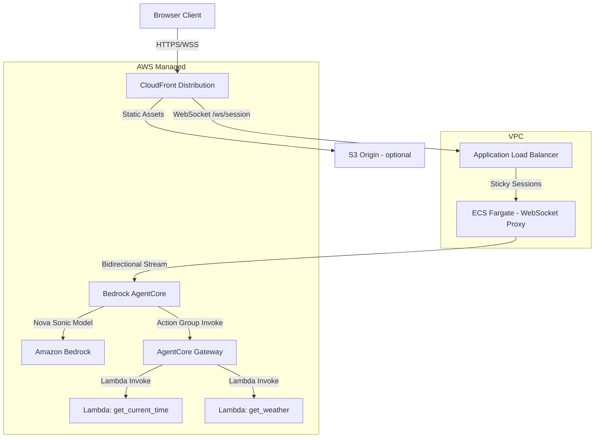
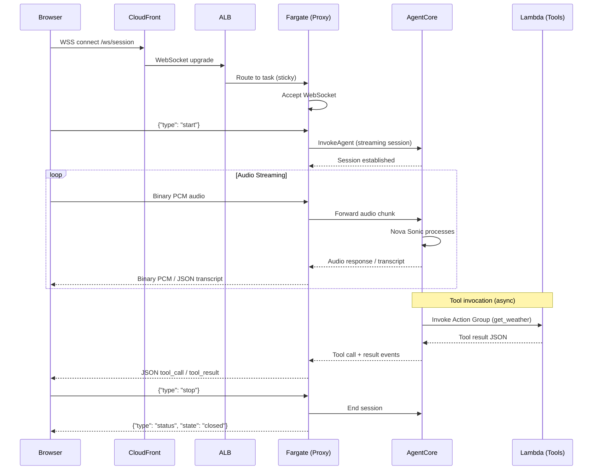

# Design Document: Cloud Deployment

## Overview

This feature deploys the Nova Sonic chatbot demo to AWS using a layered architecture that separates concerns: CloudFront for edge delivery and HTTPS termination, ALB for WebSocket routing, ECS Fargate as a thin WebSocket proxy, Bedrock AgentCore for agent orchestration and Nova Sonic session management, and Lambda functions for tool execution.

The key architectural shift is moving from a monolithic local setup (where `SessionManager` directly creates `SonicSession` and tools run in-process) to a distributed cloud architecture where Fargate only proxies WebSocket traffic to AgentCore, and tools execute as independent Lambda functions invoked via AgentCore Action Groups. Local development mode is preserved — the existing `SonicSession` path remains functional when running locally.

The infrastructure is defined as AWS CDK (Python), enabling repeatable deployments and environment-specific configuration.

## Architecture



### Request Flow



## Components and Interfaces

### Component 1: Fargate WebSocket Proxy

**Purpose**: Thin proxy that terminates browser WebSocket connections and bridges audio/control messages to Bedrock AgentCore's bidirectional streaming API. Also serves the static frontend.

**Interface**:
```python
class AgentCoreSessionManager:
    """Replaces direct SonicSession usage in cloud mode."""

    def __init__(
        self,
        send_text: Callable[[str], Awaitable[None]],
        send_bytes: Callable[[bytes], Awaitable[None]],
        *,
        agent_id: str,
        agent_alias_id: str,
        region: str,
    ) -> None: ...

    @property
    def state(self) -> SessionState: ...

    async def start(self) -> None:
        """Open AgentCore streaming session."""
        ...

    async def handle_audio(self, pcm_bytes: bytes) -> None:
        """Forward validated PCM audio to AgentCore."""
        ...

    async def run_event_loop(self) -> None:
        """Consume AgentCore response stream, route to WebSocket."""
        ...

    async def stop(self) -> None:
        """Close AgentCore session gracefully."""
        ...
```

**Responsibilities**:
- Serve static HTML/JS frontend
- Accept WebSocket connections at `/ws/session`
- Validate and forward PCM audio to AgentCore
- Route AgentCore responses (audio, transcripts, tool events) back to browser
- Health check endpoint at `GET /health`
- Bind to `0.0.0.0:8000`

### Component 2: Bedrock AgentCore Agent

**Purpose**: Orchestration layer that manages Nova Sonic sessions, routes tool calls to Lambda functions via Action Groups, and maintains conversation state.

**Interface** (configuration, not code):
```python
# AgentCore Agent Configuration
agent_config = {
    "agent_name": "nova-sonic-chatbot",
    "foundation_model": "amazon.nova-2-sonic-v1:0",
    "instruction": (
        "You are a friendly voice assistant. Keep replies short and natural. "
        "When the user asks about the time, call the get_current_time tool. "
        "When the user asks about the weather, call the get_weather tool. "
        "After a tool returns, summarize the result in one or two sentences."
    ),
    "idle_session_ttl_in_seconds": 600,
}

# Action Group Configuration
action_groups = [
    {
        "action_group_name": "time-tools",
        "description": "Tools for getting current time information",
        "action_group_executor": {"lambda_": "<lambda_arn>"},
        "api_schema": {  # OpenAPI schema for get_current_time
            ...
        },
    },
    {
        "action_group_name": "weather-tools",
        "description": "Tools for getting weather information",
        "action_group_executor": {"lambda_": "<lambda_arn>"},
        "api_schema": {  # OpenAPI schema for get_weather
            ...
        },
    },
]
```

**Responsibilities**:
- Manage Nova Sonic model sessions
- Handle audio input/output streaming
- Route tool calls to appropriate Lambda functions
- Return tool results to the model for response generation
- Manage conversation context and session lifecycle

### Component 3: Lambda Tool Functions

**Purpose**: Stateless tool execution handlers invoked by AgentCore Action Groups.

**Interface**:
```python
# Lambda handler signature for AgentCore Action Groups
def lambda_handler(event: dict, context: Any) -> dict:
    """
    event shape (from AgentCore):
    {
        "messageVersion": "1.0",
        "agent": {...},
        "inputText": "...",
        "sessionId": "...",
        "actionGroup": "time-tools",
        "apiPath": "/get_current_time",
        "httpMethod": "GET",
        "parameters": [...],
        "requestBody": {...}
    }

    response shape:
    {
        "messageVersion": "1.0",
        "response": {
            "actionGroup": "time-tools",
            "apiPath": "/get_current_time",
            "httpMethod": "GET",
            "responseBody": {
                "application/json": {
                    "body": "{\"timestamp\": \"...\", \"timezone\": \"UTC\"}"
                }
            }
        }
    }
    """
    ...
```

**Responsibilities**:
- Execute `get_current_time` logic (timezone-aware ISO 8601 timestamp)
- Execute `get_weather` logic (deterministic mock weather based on city hash)
- Return properly formatted AgentCore Action Group responses
- Handle input validation and error cases

### Component 4: CDK Infrastructure Stack

**Purpose**: Define all AWS resources as code for repeatable deployment.

**Interface**:
```python
class ChatbotDemoStack(Stack):
    def __init__(self, scope: Construct, id: str, **kwargs) -> None: ...

class NetworkStack(Stack):
    """VPC, subnets, security groups."""
    ...

class ComputeStack(Stack):
    """ECS cluster, Fargate service, task definition, ALB."""
    ...

class AgentStack(Stack):
    """AgentCore agent, action groups, Lambda functions."""
    ...

class DistributionStack(Stack):
    """CloudFront distribution."""
    ...
```

**Responsibilities**:
- VPC with public and private subnets
- ECS Fargate cluster, service, and task definition
- ALB with WebSocket-compatible target group (sticky sessions)
- CloudFront distribution with WebSocket passthrough
- Lambda functions with appropriate IAM roles
- AgentCore agent and action group configuration
- IAM roles: Fargate → AgentCore, AgentCore → Bedrock + Lambda, Lambda execution

## Data Models

### Model 1: Environment Configuration

```python
from dataclasses import dataclass
from typing import Optional

@dataclass(frozen=True)
class DeploymentConfig:
    """Configuration for cloud deployment, loaded from environment."""
    mode: str  # "local" | "cloud"
    region: str
    agent_id: Optional[str] = None  # Required in cloud mode
    agent_alias_id: Optional[str] = None  # Required in cloud mode
    agentcore_endpoint: Optional[str] = None  # Override for testing

    def validate(self) -> None:
        if self.mode == "cloud":
            if not self.agent_id:
                raise ValueError("AGENT_ID required in cloud mode")
            if not self.agent_alias_id:
                raise ValueError("AGENT_ALIAS_ID required in cloud mode")
```

**Validation Rules**:
- `mode` must be one of `"local"` or `"cloud"`
- In cloud mode, `agent_id` and `agent_alias_id` are required
- `region` must be in `SUPPORTED_REGIONS`

### Model 2: AgentCore Stream Events

```python
from dataclasses import dataclass
from typing import Literal, Union

@dataclass
class AgentCoreAudioChunk:
    """Audio data received from AgentCore."""
    pcm_bytes: bytes

@dataclass
class AgentCoreTranscript:
    """Transcript event from AgentCore."""
    role: Literal["USER", "ASSISTANT"]
    text: str

@dataclass
class AgentCoreToolCall:
    """Tool invocation notification from AgentCore."""
    tool_name: str
    arguments: dict

@dataclass
class AgentCoreToolResult:
    """Tool result notification from AgentCore."""
    tool_name: str
    result: dict

@dataclass
class AgentCoreSessionEnd:
    """Session ended by AgentCore."""
    reason: str

AgentCoreEvent = Union[
    AgentCoreAudioChunk,
    AgentCoreTranscript,
    AgentCoreToolCall,
    AgentCoreToolResult,
    AgentCoreSessionEnd,
]
```

### Model 3: Lambda Event/Response Shapes

```python
from typing import TypedDict, List, Optional

class ActionGroupParameter(TypedDict):
    name: str
    type: str
    value: str

class ActionGroupRequestBody(TypedDict, total=False):
    content: dict

class ActionGroupEvent(TypedDict):
    messageVersion: str
    agent: dict
    inputText: str
    sessionId: str
    actionGroup: str
    apiPath: str
    httpMethod: str
    parameters: List[ActionGroupParameter]
    requestBody: Optional[ActionGroupRequestBody]

class ActionGroupResponseBody(TypedDict):
    body: str  # JSON string

class ActionGroupResponse(TypedDict):
    actionGroup: str
    apiPath: str
    httpMethod: str
    responseBody: dict  # {"application/json": ActionGroupResponseBody}

class LambdaResponse(TypedDict):
    messageVersion: str
    response: ActionGroupResponse
```

## Algorithmic Pseudocode

### Main Processing Algorithm: Cloud Session Lifecycle

```python
async def cloud_session_lifecycle(
    websocket: WebSocket,
    config: DeploymentConfig,
) -> None:
    """
    Main algorithm for handling a WebSocket session in cloud mode.

    PRECONDITIONS:
    - websocket is accepted and connected
    - config.mode == "cloud"
    - config.agent_id and config.agent_alias_id are set
    - AWS credentials are resolvable

    POSTCONDITIONS:
    - AgentCore session is properly closed
    - WebSocket is cleaned up
    - No resource leaks (tasks cancelled, streams closed)

    LOOP INVARIANT:
    - At most one AgentCore session is active per WebSocket connection
    - State machine transitions are monotonic within a session attempt
    """
    manager = AgentCoreSessionManager(
        send_text=websocket.send_text,
        send_bytes=websocket.send_bytes,
        agent_id=config.agent_id,
        agent_alias_id=config.agent_alias_id,
        region=config.region,
    )

    event_loop_task = None

    try:
        while True:
            message = await websocket.receive()

            if is_start_command(message):
                await manager.start()
                if manager.state == "active":
                    event_loop_task = asyncio.create_task(manager.run_event_loop())

            elif is_stop_command(message):
                await manager.stop()
                if event_loop_task:
                    event_loop_task.cancel()
                    event_loop_task = None

            elif is_audio(message):
                await manager.handle_audio(message["bytes"])

            elif is_disconnect(message):
                break
    finally:
        if event_loop_task:
            event_loop_task.cancel()
        await manager.stop()
```

### AgentCore Session Start Algorithm

```python
async def agentcore_start_session(
    agent_id: str,
    agent_alias_id: str,
    session_id: str,
    region: str,
) -> AgentCoreStream:
    """
    Open a bidirectional streaming session with AgentCore.

    PRECONDITIONS:
    - agent_id refers to a valid, prepared AgentCore agent
    - agent_alias_id refers to a valid alias of that agent
    - AWS credentials have bedrock:InvokeAgent permission
    - region is in SUPPORTED_REGIONS

    POSTCONDITIONS:
    - Returns an active bidirectional stream
    - Stream accepts audio input and produces audio/text/tool output
    - Session is registered in AgentCore with the given session_id

    ERROR CONDITIONS:
    - AccessDeniedException → raise BedrockOpenError("auth", ...)
    - ResourceNotFoundException → raise BedrockOpenError("model", ...)
    - Timeout after 10s → raise BedrockOpenError("timeout", ...)
    - Network error → raise BedrockOpenError("network", ...)
    """
    import boto3

    client = boto3.client("bedrock-agent-runtime", region_name=region)

    response = client.invoke_agent(
        agentId=agent_id,
        agentAliasId=agent_alias_id,
        sessionId=session_id,
        enableTrace=False,
        inputText="",  # Audio session - no initial text
    )

    return response["completion"]  # EventStream
```

### Audio Forwarding Algorithm

```python
async def forward_audio_to_agentcore(
    pcm_bytes: bytes,
    stream: AgentCoreStream,
) -> None:
    """
    Forward validated PCM audio from browser to AgentCore.

    PRECONDITIONS:
    - len(pcm_bytes) > 0
    - len(pcm_bytes) % 2 == 0 (16-bit PCM samples)
    - stream is open and accepting input

    POSTCONDITIONS:
    - Audio chunk is queued for delivery to AgentCore
    - No modification to audio data (pass-through)

    LOOP INVARIANT (caller):
    - Audio chunks are forwarded in order received from browser
    - No chunks are dropped unless session is not active
    """
    if not validate_audio_bytes(pcm_bytes):
        return

    await stream.send_audio_chunk(pcm_bytes)
```

### Lambda Tool Handler Algorithm

```python
def handle_tool_invocation(
    event: ActionGroupEvent,
) -> LambdaResponse:
    """
    Process an AgentCore Action Group invocation.

    PRECONDITIONS:
    - event["messageVersion"] == "1.0"
    - event["apiPath"] is a recognized tool path
    - event["parameters"] contains required parameters for the tool

    POSTCONDITIONS:
    - Returns a valid LambdaResponse with messageVersion "1.0"
    - response.responseBody contains JSON-serialized tool result
    - On error: responseBody contains {"error": "<error_type>"}

    ERROR HANDLING:
    - Unknown apiPath → {"error": "unknown_tool"}
    - Missing required params → {"error": "invalid_arguments"}
    - Internal error → {"error": "<exception_message>"}
    """
    api_path = event["apiPath"]
    parameters = {p["name"]: p["value"] for p in event.get("parameters", [])}

    if api_path == "/get_current_time":
        result = execute_get_current_time(parameters)
    elif api_path == "/get_weather":
        result = execute_get_weather(parameters)
    else:
        result = {"error": "unknown_tool"}

    return {
        "messageVersion": "1.0",
        "response": {
            "actionGroup": event["actionGroup"],
            "apiPath": api_path,
            "httpMethod": event["httpMethod"],
            "responseBody": {
                "application/json": {
                    "body": json.dumps(result)
                }
            },
        },
    }
```

## Key Functions with Formal Specifications

### Function 1: create_session_manager()

```python
def create_session_manager(
    send_text: Callable[[str], Awaitable[None]],
    send_bytes: Callable[[bytes], Awaitable[None]],
    config: DeploymentConfig,
) -> Union[SessionManager, AgentCoreSessionManager]:
    """Factory that returns the appropriate session manager based on mode."""
```

**Preconditions:**
- `send_text` and `send_bytes` are valid async callables
- `config` has been validated (config.validate() does not raise)

**Postconditions:**
- If `config.mode == "local"`: returns a `SessionManager` (existing behavior)
- If `config.mode == "cloud"`: returns an `AgentCoreSessionManager`
- Returned manager is in `"ready"` state

**Loop Invariants:** N/A

### Function 2: AgentCoreSessionManager.start()

```python
async def start(self) -> None:
    """Open AgentCore streaming session."""
```

**Preconditions:**
- `self.state` is `"ready"` or `"error"`
- AWS credentials are resolvable
- `self._agent_id` and `self._agent_alias_id` are set

**Postconditions:**
- On success: `self.state == "active"`, AgentCore stream is open
- On failure: `self.state == "error"`, error message sent to client
- State transitions: ready → connecting → active OR ready → connecting → error

**Loop Invariants:** N/A

### Function 3: AgentCoreSessionManager.run_event_loop()

```python
async def run_event_loop(self) -> None:
    """Consume AgentCore response stream and route events to WebSocket."""
```

**Preconditions:**
- `self.state == "active"`
- AgentCore stream is open and producing events
- WebSocket is connected

**Postconditions:**
- All audio events forwarded as binary WebSocket messages
- All transcript events forwarded as JSON WebSocket messages
- Tool call/result events forwarded as JSON WebSocket messages
- On stream end: method returns normally
- On error: transitions to error state

**Loop Invariants:**
- Events are processed in order received from AgentCore
- Each event is routed to exactly one handler (audio → binary, text → JSON)
- WebSocket connection state is checked before each send

### Function 4: build_lambda_handler()

```python
def lambda_handler(event: dict, context: Any) -> dict:
    """AgentCore Action Group Lambda handler."""
```

**Preconditions:**
- `event["messageVersion"] == "1.0"`
- `event["apiPath"]` is a string
- `event["actionGroup"]` is a string

**Postconditions:**
- Returns dict with `messageVersion` == "1.0"
- `response.responseBody["application/json"]["body"]` is valid JSON string
- Function completes within Lambda timeout (default 30s)
- No side effects beyond the returned response

**Loop Invariants:** N/A (stateless function)

## Example Usage

```python
# Example 1: Local mode (unchanged behavior)
import os
os.environ["DEPLOYMENT_MODE"] = "local"

config = DeploymentConfig(mode="local", region="us-east-1")
manager = create_session_manager(send_text, send_bytes, config)
# Returns existing SessionManager — direct SonicSession path

# Example 2: Cloud mode
os.environ["DEPLOYMENT_MODE"] = "cloud"
os.environ["AGENT_ID"] = "ABCDEF1234"
os.environ["AGENT_ALIAS_ID"] = "TSTALIASID"

config = DeploymentConfig(
    mode="cloud",
    region="ap-northeast-1",
    agent_id="ABCDEF1234",
    agent_alias_id="TSTALIASID",
)
config.validate()  # Raises if missing required fields
manager = create_session_manager(send_text, send_bytes, config)
# Returns AgentCoreSessionManager — proxies to AgentCore

# Example 3: Lambda tool handler
event = {
    "messageVersion": "1.0",
    "agent": {"name": "nova-sonic-chatbot", "version": "1"},
    "inputText": "",
    "sessionId": "session-123",
    "actionGroup": "weather-tools",
    "apiPath": "/get_weather",
    "httpMethod": "POST",
    "parameters": [{"name": "city", "type": "string", "value": "Tokyo"}],
    "requestBody": {},
}
result = lambda_handler(event, None)
assert result["messageVersion"] == "1.0"
assert "temperature_c" in json.loads(
    result["response"]["responseBody"]["application/json"]["body"]
)

# Example 4: Dockerfile usage
# docker build -t nova-sonic-proxy .
# docker run -p 8000:8000 \
#   -e DEPLOYMENT_MODE=cloud \
#   -e AGENT_ID=ABCDEF1234 \
#   -e AGENT_ALIAS_ID=TSTALIASID \
#   -e AWS_REGION=ap-northeast-1 \
#   nova-sonic-proxy

# Example 5: CDK deployment
# cd infra/
# cdk deploy --all --require-approval never
```

## Correctness Properties

### Property 1: Mode Isolation

∀ config where config.mode == "local": the system MUST NOT make any AgentCore API calls; it uses the existing `SonicSession` path directly. Conversely, ∀ config where config.mode == "cloud": the system MUST NOT create a `SonicSession` directly.

### Property 2: Audio Integrity

∀ pcm_bytes forwarded from browser to AgentCore: the bytes are identical (no transformation, resampling, or reordering). The proxy is a pass-through — it validates but does not modify audio data.

### Property 3: Session State Machine

∀ session manager instance: state transitions follow exactly one of the valid paths: ready → connecting → active → closed, OR ready → connecting → error → ready (retry). No state can be skipped, and transitions are monotonic within a single session attempt.

### Property 4: Tool Result Equivalence

∀ tool invocation with identical arguments: Lambda handler produces the same result as the in-process tool handler. For `get_weather`, results are fully deterministic (same city → same weather). For `get_current_time`, the timezone parameter produces a valid ISO 8601 timestamp in the requested timezone.

### Property 5: Graceful Shutdown

∀ WebSocket disconnect: the AgentCore session is closed within `SHUTDOWN_DEADLINE_S` seconds, and no orphaned asyncio tasks remain. Resources are released in reverse order of acquisition.

### Property 6: Health Check Availability

∀ Fargate task in RUNNING state: `GET /health` returns HTTP 200 within 5 seconds. The health check does not depend on AgentCore connectivity — it only verifies the proxy process is responsive.

### Property 7: Sticky Session Correctness

∀ WebSocket connection: all frames for that connection are routed to the same Fargate task for the connection's lifetime. ALB uses connection-level stickiness (not cookie-based) for WebSocket upgrades.

### Property 8: IAM Least Privilege

∀ IAM role: permissions are scoped to exactly the resources needed. Fargate task role can only invoke its specific AgentCore agent. Lambda execution roles have only CloudWatch Logs access. AgentCore role can only invoke the specific Lambda functions and Bedrock model.

## Error Handling

### Error Scenario 1: AgentCore Connection Failure

**Condition**: Fargate cannot establish a streaming session with AgentCore (network timeout, auth failure, agent not found).
**Response**: Transition to `"error"` state, send `ErrorMessage` to browser with descriptive message.
**Recovery**: User can retry by sending another `"start"` command. Manager transitions error → ready → connecting.

### Error Scenario 2: AgentCore Stream Interruption

**Condition**: Active AgentCore stream drops mid-session (network blip, AgentCore internal error).
**Response**: Transition to `"error"` state, send `ErrorMessage` to browser.
**Recovery**: User sends `"stop"` then `"start"` to establish a new session. Previous session state is lost.

### Error Scenario 3: Lambda Timeout

**Condition**: Lambda function exceeds its configured timeout (30s default).
**Response**: AgentCore receives a timeout error from Lambda, reports tool failure to the model. Model generates a verbal apology to the user.
**Recovery**: Automatic — AgentCore handles the tool failure gracefully.

### Error Scenario 4: WebSocket Disconnect During Active Session

**Condition**: Browser closes WebSocket (tab close, network loss) while AgentCore session is active.
**Response**: Fargate detects disconnect, cancels event loop task, closes AgentCore session within `SHUTDOWN_DEADLINE_S`.
**Recovery**: N/A — session is terminated. User reconnects and starts fresh.

### Error Scenario 5: Fargate Task Crash

**Condition**: Fargate task terminates unexpectedly (OOM, unhandled exception).
**Response**: ALB health check fails, ECS replaces the task. Active WebSocket connections on that task are lost.
**Recovery**: Browser detects WebSocket close, can reconnect. New connection routes to a healthy task.

### Error Scenario 6: Invalid Audio Data

**Condition**: Browser sends binary data that fails PCM validation (length 0 or not multiple of 2).
**Response**: Audio is silently dropped (not forwarded to AgentCore). No error sent to browser.
**Recovery**: N/A — next valid audio frame is processed normally.

## Testing Strategy

### Unit Testing Approach

- **AgentCoreSessionManager**: Mock the boto3 AgentCore client. Test state transitions (ready → connecting → active, error paths). Verify audio forwarding calls the stream correctly.
- **Lambda handlers**: Test with sample AgentCore event payloads. Verify response format matches expected schema. Test edge cases (missing params, unknown paths).
- **DeploymentConfig**: Test validation logic for both modes. Test environment variable loading.
- **Mode factory**: Test that `create_session_manager` returns correct type based on config.

### Property-Based Testing Approach

**Property Test Library**: hypothesis

- **Audio pass-through property**: For any valid PCM bytes (len > 0, len % 2 == 0), the bytes forwarded to AgentCore are identical to those received from the browser.
- **Lambda response format property**: For any valid ActionGroupEvent, the response always has `messageVersion == "1.0"` and a valid `responseBody` structure.
- **Config validation property**: For any DeploymentConfig with mode="cloud", validation passes if and only if both agent_id and agent_alias_id are non-empty strings.
- **Tool result equivalence property**: For any city string, `get_weather` Lambda produces the same result as the in-process `get_weather` function.

### Integration Testing Approach

- **Local mode regression**: Existing test suite continues to pass unchanged.
- **Docker build**: CI builds the Dockerfile and verifies the container starts and responds to health checks.
- **CDK synth**: CI runs `cdk synth` to validate the infrastructure template without deploying.

## Performance Considerations

- **Fargate sizing**: Start with 0.5 vCPU / 1 GB memory per task. Each task handles multiple concurrent WebSocket connections. Monitor and scale based on connection count.
- **ALB idle timeout**: Set to 3600s (1 hour) to support long voice sessions without premature WebSocket closure.
- **CloudFront WebSocket**: Use cache behavior with `CachePolicyName: Disabled` for the `/ws/session` path. WebSocket connections are not cacheable.
- **Lambda cold start**: Tools are lightweight (no heavy imports). Expected cold start < 500ms. Provisioned concurrency not needed for demo scale.
- **Audio latency budget**: Browser → CloudFront → ALB → Fargate → AgentCore should add < 50ms per hop. Total added latency vs local: ~100-150ms (acceptable for voice).

## Security Considerations

- **No secrets in container image**: All credentials resolved via IAM task role (ECS task execution role + task role). No AWS keys baked into Docker image.
- **VPC isolation**: Fargate tasks run in private subnets. Only ALB is in public subnets. AgentCore and Lambda accessed via AWS PrivateLink or public endpoints with IAM auth.
- **CloudFront → ALB**: Use custom header (`X-Custom-Header`) to restrict ALB to only accept traffic from CloudFront. ALB security group allows only CloudFront IP ranges.
- **WebSocket origin validation**: Fargate validates `Origin` header on WebSocket upgrade to prevent cross-site WebSocket hijacking.
- **IAM least privilege**:
  - Fargate task role: `bedrock:InvokeAgent` on the specific agent ARN only
  - AgentCore execution role: `bedrock:InvokeModel` for Nova Sonic, `lambda:InvokeFunction` for tool Lambdas only
  - Lambda execution role: CloudWatch Logs only (tools have no external dependencies)

## Dependencies

- **Runtime (Fargate)**:
  - `boto3` — AWS SDK for AgentCore API calls
  - `fastapi` — Web framework (existing)
  - `uvicorn` — ASGI server (existing)

- **Runtime (Lambda)**:
  - Python 3.12 runtime (built-in `zoneinfo`, `hashlib`, `datetime`)
  - No external dependencies needed

- **Infrastructure**:
  - `aws-cdk-lib` — CDK v2 core library
  - `constructs` — CDK constructs base

- **Development**:
  - `pytest` + `hypothesis` — Testing (existing)
  - `moto` or `boto3-stubs` — AWS mocking for unit tests
