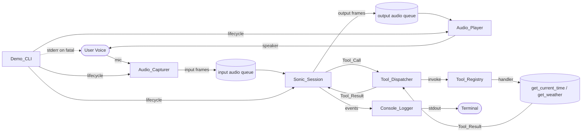
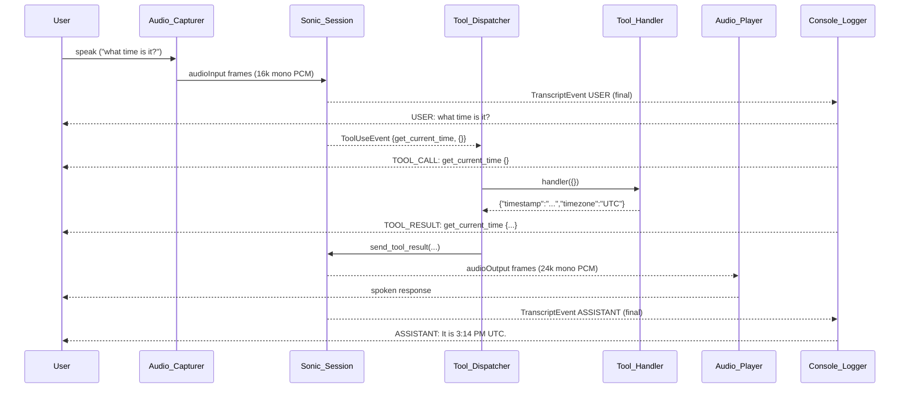
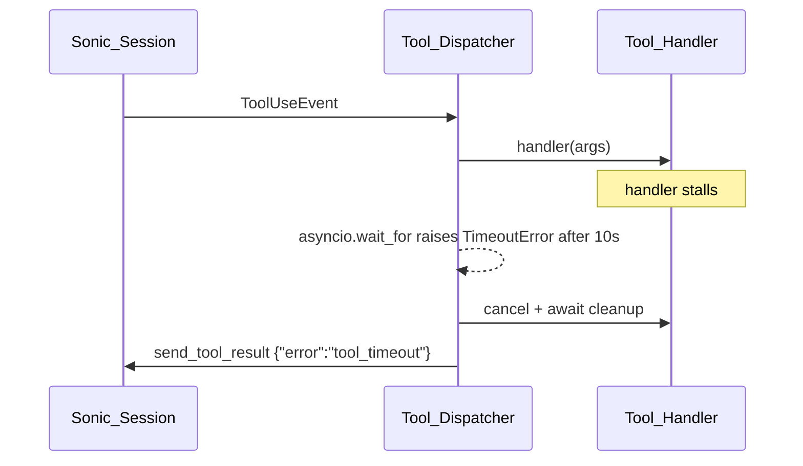

# Design Document

## Overview

The Nova_Sonic_Demo is a single-process Python 3.10+ command-line application that demonstrates end-to-end speech-to-speech interaction with Amazon Nova Sonic v2 (`amazon.nova-sonic-v2:0`) via Amazon Bedrock's `InvokeModelWithBidirectionalStream` API. The demo captures microphone audio, streams it to the model, plays back the model's spoken response through the speakers, and supports tool calls so the model can invoke local Python functions (`get_current_time`, `get_weather`) when the spoken request requires them.

The design favors simplicity and clarity over feature completeness: all components run in a single process under one asyncio event loop, audio is moved through bounded queues to decouple device I/O from network streaming, and the tool-call lifecycle is encapsulated in a small dispatcher that can be extended later. The demo is intended as a starting point; future versions can add barge-in, telephony integration, or session continuation without rearchitecting the core flow.

## Architecture

### High-Level Component Diagram



### Process and Concurrency Model

The demo runs a single `asyncio` event loop. Three long-lived async tasks coordinate through bounded `asyncio.Queue` instances:

1. **Capture task**: A `sounddevice.RawInputStream` callback writes 16 kHz / 16-bit / mono PCM frames into the `input audio queue`. An async pump task drains the queue and emits `audioInput` events to the Bedrock stream.
2. **Stream task**: Consumes events from the Bedrock response stream. Routes audio output frames to the `output audio queue`, transcript events to the console logger, and tool-use events to the tool dispatcher.
3. **Playback task**: A `sounddevice.RawOutputStream` callback drains the `output audio queue` and writes 24 kHz / 16-bit / mono PCM frames to the speaker.

Tool dispatch runs on the same loop. Each `Tool_Call` is wrapped in `asyncio.wait_for(...)` with a 10-second timeout, so a slow or hung handler cannot block the stream.

### Module Layout

```
nova_sonic_demo/
├── __init__.py
├── __main__.py            # entry point: python -m nova_sonic_demo
├── cli.py                 # Demo_CLI: argv parsing, lifecycle, top-level error handling
├── config.py              # AWS region resolution, supported-region check, constants
├── session.py             # Sonic_Session: Bedrock bidirectional stream wrapper
├── audio.py               # Audio_Capturer and Audio_Player (sounddevice wrappers)
├── tools/
│   ├── __init__.py
│   ├── registry.py        # Tool_Registry, JSON Schemas, dispatcher
│   ├── time_tool.py       # get_current_time handler
│   └── weather_tool.py    # get_weather handler (mocked)
├── events.py              # input/output event builders for Nova Sonic protocol
└── logging.py             # Console_Logger with prefix formatting
tests/
├── test_tool_registry.py
├── test_tool_handlers.py
├── test_event_builders.py
├── test_logger.py
└── test_session_routing.py
requirements.txt
README.md
```

## Components

### Demo_CLI (`cli.py`)

Responsible for the lifecycle: parse CLI args, validate environment, construct the `Sonic_Session`, wire it to `Audio_Capturer` and `Audio_Player`, and handle top-level shutdown. Catches `KeyboardInterrupt` and triggers graceful shutdown.

Public API:

```python
async def run(args: list[str]) -> int: ...
def main() -> None: ...   # invoked from __main__.py
```

Lifecycle:

1. Resolve AWS region (env `AWS_REGION` → AWS SDK default chain).
2. Verify region is in `SUPPORTED_REGIONS`. If not, write to stderr, exit 2.
3. Probe input/output audio devices via `sounddevice.query_devices`. If either is missing, write to stderr, exit 3.
4. Build `Sonic_Session` and call `await session.open()` with a 10-second timeout.
5. On open failure: classify error (`AuthError`, `NetworkError`, `RegionError`, `ModelError`), write to stderr with category + underlying message, exit non-zero.
6. Print startup banner via `Console_Logger.banner(model_id, region)`.
7. Start `Audio_Capturer` and `Audio_Player`. Print `LISTENING:` line.
8. Run the session until `KeyboardInterrupt` (Ctrl+C). On Ctrl+C: stop capturer, stop player, close session, release devices. Exit 0 within 5 seconds (enforced by `asyncio.wait_for` on shutdown).

### Sonic_Session (`session.py`)

Encapsulates the Bedrock bidirectional stream. Owns the lifecycle of the model session and exposes typed methods for the rest of the app to send/receive events.

Public API:

```python
class SonicSession:
    def __init__(self, region: str, tools: ToolRegistry, logger: ConsoleLogger): ...
    async def open(self) -> None: ...
    async def send_audio(self, pcm_frames: bytes) -> None: ...
    async def stream_events(self) -> AsyncIterator[OutputEvent]: ...
    async def send_tool_result(self, tool_use_id: str, result: dict) -> None: ...
    async def close(self) -> None: ...
```

Internally:

- Calls `bedrock_runtime.invoke_model_with_bidirectional_stream(modelId="amazon.nova-sonic-v2:0")`.
- Sends the canonical Nova Sonic event sequence: `sessionStart` → `promptStart` (with audio output config and `toolConfiguration` containing the JSON Schemas from `Tool_Registry`) → `contentStart` (audio) → repeated `audioInput` → `contentEnd` per turn.
- Tracks `promptName` and per-turn `contentName` UUIDs so subsequent events reference the correct identifiers.
- Decodes incoming events (`audioOutput`, `textOutput` with `role=USER`/`ASSISTANT`, `toolUse`) and yields a typed `OutputEvent` union to consumers.

The session is closeable from any task. `close()` sends `contentEnd` + `promptEnd` + `sessionEnd` events, then closes the underlying stream. It is idempotent and safe to call from a signal handler.

### Audio_Capturer (`audio.py`)

Wraps a `sounddevice.RawInputStream` configured for 16 kHz, 16-bit, mono. The PortAudio callback runs on a background thread and pushes raw PCM bytes into a `janus.Queue` (sync/async bridge) or, if we keep dependencies small, an `asyncio.Queue` plus `loop.call_soon_threadsafe`. A pump coroutine reads frames and calls `session.send_audio(frame)`.

Public API:

```python
class AudioCapturer:
    def __init__(self, on_frame: Callable[[bytes], Awaitable[None]]): ...
    async def start(self) -> None: ...
    async def stop(self) -> None: ...
```

Frame size: 320 samples (20 ms) per chunk. Queue bound: 50 frames (~1 s buffer) to keep latency low and prevent unbounded growth.

### Audio_Player (`audio.py`)

Wraps a `sounddevice.RawOutputStream` configured for 24 kHz, 16-bit, mono. A bounded `asyncio.Queue` of output frames is drained by the PortAudio callback. When the queue is empty, the callback writes silence so the stream does not underrun.

Public API:

```python
class AudioPlayer:
    def __init__(self): ...
    async def start(self) -> None: ...
    async def enqueue(self, pcm: bytes) -> None: ...
    async def stop(self) -> None: ...
```

Queue bound: 200 frames (~1.7 s at 24 kHz) so playback is smooth without growing memory under back-pressure.

### Tool_Registry and Tool_Dispatcher (`tools/registry.py`)

The `Tool_Registry` is constructed at startup with a fixed set of `ToolDefinition` records and produces the `toolConfiguration` payload sent in the `promptStart` event.

```python
@dataclass(frozen=True)
class ToolDefinition:
    name: str
    description: str            # 1..200 chars
    schema: dict                # JSON Schema for arguments
    handler: Callable[[dict], Awaitable[dict]]

class ToolRegistry:
    def __init__(self, definitions: list[ToolDefinition]): ...
    def to_bedrock_config(self) -> dict: ...
    def get(self, name: str) -> ToolDefinition | None: ...

class ToolDispatcher:
    def __init__(self, registry: ToolRegistry, logger: ConsoleLogger, timeout_s: float = 10.0): ...
    async def dispatch(self, tool_use_id: str, tool_name: str, arguments: dict) -> dict: ...
```

Dispatch flow (Requirements 3.1, 3.4, 3.6, 3.7, 3.8 and 2.6):

1. Logger emits `TOOL_CALL: <name> <args-json>` to stdout (before handler runs).
2. If tool is unknown → return `{"error": "unknown_tool", "tool": name}`.
3. Validate `arguments` against the registered JSON Schema. On failure → return `{"error": "invalid_arguments"}`.
4. Run `await asyncio.wait_for(handler(arguments), timeout=10.0)`.
5. On `asyncio.TimeoutError` → return `{"error": "tool_timeout"}` (the handler task is cancelled and awaited to release resources).
6. On any other exception → catch, build `{"error": str(exc)[:200]}`, ensure handler resources are released (each handler is responsible for `try/finally` cleanup; the dispatcher additionally awaits cancellation), and resume.
7. Logger emits `TOOL_RESULT: <name> <result-json>` to stdout.
8. Returned dict is delivered to `Sonic_Session.send_tool_result(tool_use_id, result)`.

The dispatcher is stateless across calls; each call uses only its own arguments. After any error the next call begins from the same initial state, satisfying Requirement 3.5.

### Tool Handlers

#### `get_current_time` (`tools/time_tool.py`)

```python
{
  "name": "get_current_time",
  "description": "Return the current ISO 8601 timestamp in the requested timezone.",
  "schema": {
    "type": "object",
    "properties": {"timezone": {"type": "string"}},
    "required": []
  }
}
```

Behavior:
- If `timezone` omitted → resolve to `"UTC"`.
- Resolve the IANA timezone via `zoneinfo.ZoneInfo(name)`. On `ZoneInfoNotFoundError` → `{"error": "invalid_timezone"}`.
- Return `{"timestamp": "<ISO 8601 with offset>", "timezone": "<resolved IANA name>"}`.

#### `get_weather` (`tools/weather_tool.py`)

```python
{
  "name": "get_weather",
  "description": "Return a mocked current weather report for the given city.",
  "schema": {
    "type": "object",
    "properties": {"city": {"type": "string", "minLength": 1, "maxLength": 100}},
    "required": ["city"]
  }
}
```

Behavior:
- Trim `city`. If missing or empty after trim → `{"error": "invalid_arguments"}`.
- Compute deterministic mock: `seed = stable_hash(city.lower())`; pick `condition` from `["sunny", "cloudy", "rainy", "snowy", "windy"]` and `temperature_c` in `[-50, 50]` from the seed.
- Return `{"city": <city>, "condition": <c>, "temperature_c": <t>}`.
- Determinism: identical input arguments within a single process run produce identical output (Requirement 2.5).

### Console_Logger (`logging.py`)

Wraps stdout writes and centralizes prefix formatting. Behavior is gated by an `is_session_active` flag set by `SonicSession.open()` and cleared by `close()`.

Public API:

```python
class ConsoleLogger:
    def banner(self, model_id: str, region: str) -> None: ...
    def listening(self) -> None: ...
    def user(self, transcript: str) -> None: ...      # only final segments
    def assistant(self, transcript: str) -> None: ...  # only final segments
    def tool_call(self, name: str, arguments: dict) -> None: ...
    def tool_result(self, name: str, result: dict) -> None: ...
```

All methods write to `sys.stdout` and end with `\n`. While the session is not yet active, `user`/`assistant`/`tool_call`/`tool_result` are no-ops with no buffering (Requirement 5.2). On non-serializable payloads, `tool_call` and `tool_result` substitute `<non-serializable>` for the offending value (Requirement 5.8).

## Data Models

### Event Types (Internal)

```python
class AudioOutEvent(TypedDict):
    pcm: bytes

class TranscriptEvent(TypedDict):
    role: Literal["USER", "ASSISTANT"]
    text: str
    is_final: bool

class ToolUseEvent(TypedDict):
    tool_use_id: str
    tool_name: str
    arguments: dict

OutputEvent = Union[AudioOutEvent, TranscriptEvent, ToolUseEvent]
```

### Tool Result Shape

Success: arbitrary JSON object returned by the handler (e.g. `{"timestamp": "...", "timezone": "UTC"}`).

Error: `{"error": <error_code>, ...}` where `<error_code>` is one of:
`unknown_tool`, `invalid_timezone`, `invalid_arguments`, `tool_timeout`, or a free-form 1..200-char string when the handler raised an unexpected exception.

### Configuration Constants (`config.py`)

```python
MODEL_ID = "amazon.nova-sonic-v2:0"
INPUT_SAMPLE_RATE_HZ = 16_000
OUTPUT_SAMPLE_RATE_HZ = 24_000
INPUT_FRAME_SAMPLES = 320           # 20 ms at 16 kHz
TOOL_DISPATCH_DEADLINE_S = 0.5
TOOL_RESULT_DEADLINE_S = 0.5
TOOL_TIMEOUT_S = 10.0
SESSION_OPEN_TIMEOUT_S = 10.0
SHUTDOWN_DEADLINE_S = 5.0
SUPPORTED_REGIONS = {"us-east-1", "us-east-2", "us-west-2"}  # adjust to current Bedrock availability
```

## Sequence Flows

### Successful Tool Call Turn



### Tool Timeout Path



## Error Handling

| Failure mode                                  | Detection point             | Action                                                                                          | Exit code |
|----------------------------------------------|-----------------------------|-------------------------------------------------------------------------------------------------|-----------|
| AWS credentials missing/invalid               | `Sonic_Session.open()`      | stderr: "AWS credentials missing or invalid"; abort                                             | 4         |
| Unsupported region                            | `Demo_CLI` startup          | stderr: "Region <r> does not support Nova Sonic v2"; abort                                      | 2         |
| Bedrock auth/network/model unavailable        | `Sonic_Session.open()`      | stderr with category + underlying error; abort                                                  | 5         |
| No microphone or speaker                      | `Demo_CLI` startup          | stderr: "Missing input device"/"Missing output device"; abort                                   | 3         |
| Tool name unknown                             | `Tool_Dispatcher`           | Tool_Result `{"error": "unknown_tool", "tool": <name>}`; session continues                      | n/a       |
| Tool args fail schema validation              | `Tool_Dispatcher`           | Tool_Result `{"error": "invalid_arguments"}`; session continues                                 | n/a       |
| Tool handler raises                           | `Tool_Dispatcher`           | Tool_Result `{"error": "<msg ≤200 chars>"}`; session continues                                  | n/a       |
| Tool handler timeout (>10 s)                  | `Tool_Dispatcher`           | Tool_Result `{"error": "tool_timeout"}`; cancel handler; session continues                      | n/a       |
| Non-serializable tool payload                 | `Console_Logger`            | Print `<non-serializable>` placeholder; session continues                                       | n/a       |
| Ctrl+C                                        | `Demo_CLI` signal           | Stop capturer/player, close session, release devices, exit within 5 s                           | 0         |

Each failure mode is reachable from a single, named call site so it can be tested in isolation.

## Property-Based Testing Strategy

These properties are executable specifications; each maps to one or more acceptance criteria.

### P1 — Tool dispatcher returns one of three result shapes (Req 2.6, 3.4, 3.7, 3.8)

For any tool name and arbitrary JSON-shaped arguments, `ToolDispatcher.dispatch` returns a dict that satisfies exactly one of:
- successful payload defined by the tool's success schema, OR
- `{"error": "unknown_tool", "tool": <name>}`, OR
- `{"error": "invalid_arguments"}`, OR
- `{"error": "tool_timeout"}`, OR
- `{"error": <string of length 1..200>}`.

Generators: `hypothesis.strategies.dictionaries` for arguments, sampled tool names from registry plus arbitrary unicode strings.

### P2 — `get_weather` is deterministic per process (Req 2.5)

For any non-empty trimmed `city`, calling `get_weather({"city": city})` twice within the same process returns equal dicts. The condition is one of the five literals and the temperature is an integer in `[-50, 50]`.

### P3 — `get_current_time` shape and timezone resolution (Req 2.2, 2.7)

For any `timezone` string `tz`:
- If `tz` is a valid IANA name, the result has `timezone == tz` and `timestamp` parses as ISO 8601.
- If `tz` is omitted, `timezone == "UTC"`.
- Otherwise the result equals `{"error": "invalid_timezone"}`.

### P4 — Console_Logger never raises on arbitrary tool payloads (Req 5.8)

For arbitrary Python values used as tool arguments or results, `tool_call`/`tool_result` complete without raising. Any non-serializable substructure is replaced by the literal `<non-serializable>` in the printed line, and the printed line still matches the expected prefix grammar.

### P5 — Logger output grammar (Req 5.4–5.7)

Every line emitted by `ConsoleLogger.user`/`assistant`/`tool_call`/`tool_result` matches the regular grammar:
`^(USER|ASSISTANT|TOOL_CALL|TOOL_RESULT): .+\n$`. For `TOOL_CALL`/`TOOL_RESULT`, the substring after the second space is single-line JSON or the literal `<non-serializable>`.

### P6 — Session lifecycle invariant (Req 1.5)

Calling `await session.close()` is idempotent: repeated calls do not raise and leave the session in the closed state. After `close()`, any logger emission of `USER`/`ASSISTANT`/`TOOL_CALL`/`TOOL_RESULT` is a no-op (Req 5.2).

### P7 — Tool dispatcher latency bound (Req 3.1, 3.2)

Under simulated handler delay `d` where `d < 10 s`, the dispatcher's wall-clock dispatch latency (start of `dispatch` to handler invocation) is `< 0.5 s`, and the time from handler return to `send_tool_result` invocation is `< 0.5 s`. Verified with a fake `Sonic_Session` that records timestamps.

These properties are implemented with `hypothesis` and run via `pytest`.

## Testing Plan

- **Unit**: pure functions in `events.py`, `tools/*`, `logging.py`.
- **Property-based**: P1–P7 above.
- **Integration (lightweight)**: a fake bidirectional stream that yields canned event sequences exercises `Sonic_Session.stream_events` routing and `Tool_Dispatcher` interaction without hitting Bedrock.
- **Manual / smoke**: documented in README; presenter speaks the example prompts ("what time is it?", "what is the weather in Seattle?") and verifies `USER:`, `TOOL_CALL:`, `TOOL_RESULT:`, `ASSISTANT:` lines plus audible response.

## Dependencies (`requirements.txt`)

Five packages, all pinned:

```
boto3==1.40.0          # AWS SDK with Bedrock runtime + bidirectional stream
aws-sdk-bedrock-runtime==0.0.4   # bidirectional stream client (alt: rely on boto3 if it ships the API)
sounddevice==0.5.0     # PortAudio-based capture and playback
hypothesis==6.115.0    # property-based tests (also dev-only)
pytest==8.3.0          # test runner (dev-only)
```

If the bidirectional stream is exposed directly on `boto3`, the `aws-sdk-bedrock-runtime` row is dropped to four runtime dependencies. The exact wire-up is finalized during implementation; either option stays within the five-package limit (Requirement 4.3).

## Open Questions

1. Which AWS regions support Nova Sonic v2 at the time of release? The `SUPPORTED_REGIONS` set in `config.py` must be updated to match Bedrock's published regional availability.
2. Should the demo prompt the model with a system prompt encouraging it to call tools? A short opinionated default ("You are a concise voice assistant. When asked about time or weather, call the matching tool.") is recommended; left for implementation tuning.
3. Live weather backend wiring is intentionally out of scope; the deterministic mock satisfies the requirement and removes external credentials.
