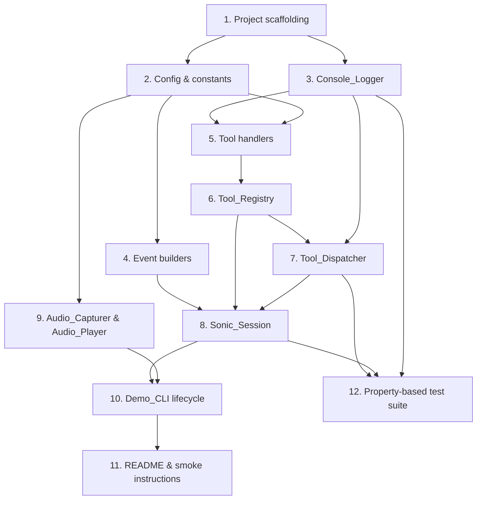

# Implementation Plan

This plan turns the design into actionable, dependency-ordered tasks. Each task lists the files it touches, the requirements it satisfies, and the executable evidence (unit tests, property-based tests, manual smoke) that proves it correct. Property labels P1–P7 reference the property-based testing strategy in `design.md`.

## Task Dependency Graph

## Tasks

- [x] 1. Set up project scaffolding and dependency manifest
  - Create `nova_sonic_demo/` package with `__init__.py`, `__main__.py`, and empty module stubs (`cli.py`, `config.py`, `session.py`, `audio.py`, `events.py`, `logging.py`, and `tools/__init__.py`).
  - Create `requirements.txt` at the project root with pinned versions for `boto3`, `sounddevice`, `hypothesis`, `pytest` (and `aws-sdk-bedrock-runtime` only if `boto3` does not expose `invoke_model_with_bidirectional_stream` directly).
  - Create `tests/` package with empty `conftest.py`.
  - `__main__.py` calls `cli.main()`.
  - _Requirements: 4.1, 4.2, 4.3, 4.4_

- [x] 2. Define configuration constants and region/credential resolution
  - In `config.py`, define `MODEL_ID`, `INPUT_SAMPLE_RATE_HZ`, `OUTPUT_SAMPLE_RATE_HZ`, `INPUT_FRAME_SAMPLES`, all timing deadlines, and `SUPPORTED_REGIONS`.
  - Implement `resolve_region() -> str` (read `AWS_REGION` env, fall back to `boto3.Session().region_name`).
  - Implement `validate_region(region: str) -> None` (raise `UnsupportedRegionError` if not in `SUPPORTED_REGIONS`).
  - Implement `assert_credentials_resolvable() -> None` that calls `boto3.Session().get_credentials()` and raises `MissingCredentialsError` on failure.
  - Define typed exception classes: `MissingCredentialsError`, `UnsupportedRegionError`, `MissingDeviceError`, `BedrockOpenError(category, underlying)`.
  - Unit tests cover region resolution precedence, the unsupported-region path, and the missing-credentials path using monkeypatched env vars.
  - _Requirements: 4.5, 4.6, 4.7, 4.8_

- [x] 3. Implement `Console_Logger` with prefix grammar and session gating
  - In `logging.py`, implement `ConsoleLogger` with methods `banner`, `listening`, `user`, `assistant`, `tool_call`, `tool_result`, plus `mark_session_active()` / `mark_session_closed()`.
  - All methods write to `sys.stdout` and end with `\n`.
  - When the session is not active, `user`/`assistant`/`tool_call`/`tool_result` are no-ops with no in-memory buffering.
  - On non-serializable arguments or results, substitute `<non-serializable>` for the offending payload.
  - Unit tests assert exact line formats for each prefix and confirm pre-session suppression.
  - _Requirements: 5.1, 5.2, 5.3, 5.4, 5.5, 5.6, 5.7, 5.8_

- [x] 4. Implement Nova Sonic event builders
  - In `events.py`, implement pure functions that return JSON dicts for `sessionStart`, `promptStart` (taking the tool configuration as input), `contentStart` for audio input, `audioInput` (taking a base64-encoded PCM frame), `contentEnd`, `promptEnd`, `sessionEnd`, and `toolResult` (taking `tool_use_id` and result dict).
  - Each builder takes a unique-name argument (`prompt_name`, `content_name`) supplied by the caller.
  - Implement `parse_output_event(raw: dict) -> OutputEvent | None` returning a typed `AudioOutEvent`, `TranscriptEvent`, or `ToolUseEvent`.
  - Unit tests cover round-tripping known sample payloads from the Nova Sonic docs and verify required fields are present.
  - _Requirements: 1.1, 2.1, 2.4, 3.1, 3.2_

- [x] 5. Implement tool handlers `get_current_time` and `get_weather`
  - In `tools/time_tool.py`, implement `async def get_current_time(args: dict) -> dict` that defaults missing `timezone` to `"UTC"`, resolves via `zoneinfo.ZoneInfo`, returns `{"timestamp": ..., "timezone": ...}`, and on `ZoneInfoNotFoundError` returns `{"error": "invalid_timezone"}`.
  - In `tools/weather_tool.py`, implement `async def get_weather(args: dict) -> dict` that trims `city`, returns `{"error": "invalid_arguments"}` when missing/empty, and otherwise returns a deterministic mock `{"city", "condition", "temperature_c"}` derived from a stable hash of `city.lower()`.
  - Unit tests pin the deterministic mapping for a small fixed sample of cities.
  - _Requirements: 2.2, 2.3, 2.5, 2.7, 2.8_

- [x] 6. Implement `Tool_Registry`
  - In `tools/registry.py`, implement `ToolDefinition` dataclass and `ToolRegistry` with `to_bedrock_config()` and `get(name)`.
  - Build the default registry containing `get_current_time` and `get_weather` with the JSON Schemas defined in `design.md` (description 1–200 chars, required arrays explicit, each parameter declares `type`).
  - Unit tests assert the registry exposes exactly two tools, both schemas validate against `jsonschema` (or a minimal hand-rolled validator if jsonschema is not in `requirements.txt`), and descriptions stay within bounds.
  - _Requirements: 2.1, 2.4_

- [x] 7. Implement `Tool_Dispatcher` with timeout and validation
  - In `tools/registry.py` (same module), implement `ToolDispatcher` with `dispatch(tool_use_id, tool_name, arguments) -> dict`.
  - Order: log `TOOL_CALL:` → unknown-name check → JSON Schema validation → `await asyncio.wait_for(handler(args), timeout=10.0)` → on `TimeoutError` cancel handler and return `{"error": "tool_timeout"}` → on other exceptions return `{"error": str(exc)[:200]}` → log `TOOL_RESULT:`.
  - Verify dispatcher does not retain state between calls.
  - Unit tests cover unknown tool, invalid args, timeout, exception, and successful path. Assert the `TOOL_CALL:` log line is written before the handler runs.
  - _Requirements: 2.6, 3.1, 3.2, 3.4, 3.5, 3.6, 3.7, 3.8, 5.6, 5.7_

- [x] 8. Implement `Sonic_Session` Bedrock wrapper
  - In `session.py`, implement `SonicSession` with `open()`, `send_audio()`, `stream_events()`, `send_tool_result()`, and `close()`.
  - `open()` calls `bedrock_runtime.invoke_model_with_bidirectional_stream(modelId=MODEL_ID)`, sends `sessionStart` → `promptStart` (using `ToolRegistry.to_bedrock_config()`) → `contentStart` for the first user audio turn, with a 10-second timeout. Categorize and re-raise as `BedrockOpenError`.
  - `send_audio()` chunks frames into `audioInput` events using the current `content_name`.
  - `stream_events()` consumes the response stream, calls `parse_output_event`, dispatches `ToolUseEvent` to `ToolDispatcher`, sends the resulting `toolResult` event back, and yields `AudioOutEvent` and final `TranscriptEvent`s for the caller.
  - `close()` is idempotent: send `contentEnd` + `promptEnd` + `sessionEnd` and close the underlying stream.
  - Integration test uses a fake bidirectional stream that yields canned event sequences; assert that a `toolUse` event triggers a dispatch and that the resulting `toolResult` event is sent back within 500 ms (mocked clock acceptable).
  - _Requirements: 1.1, 1.4, 3.1, 3.2, 3.3, 5.1_

- [x] 9. Implement `Audio_Capturer` and `Audio_Player`
  - In `audio.py`, implement `AudioCapturer` wrapping `sounddevice.RawInputStream` (16 kHz, 16-bit, mono, frame=320). Use a bounded thread-safe queue plus `loop.call_soon_threadsafe` to bridge the PortAudio callback to the asyncio loop. Pump task awaits frames and calls `on_frame(frame)`.
  - Implement `AudioPlayer` wrapping `sounddevice.RawOutputStream` (24 kHz, 16-bit, mono). PortAudio callback drains a bounded `asyncio.Queue` and writes silence on underrun.
  - Both expose `start()` and `stop()`. `stop()` releases the device handle.
  - Implement `probe_audio_devices()` that raises `MissingDeviceError("input"|"output")` if either is missing.
  - Unit tests use a fake `sounddevice` module to assert correct stream parameters and that `stop()` closes the stream exactly once.
  - _Requirements: 1.2, 1.3, 1.7_

- [x] 10. Implement `Demo_CLI` lifecycle and signal handling
  - In `cli.py`, implement `async def run(args: list[str]) -> int` and `def main() -> None` per the lifecycle in `design.md`.
  - Order: probe devices → resolve and validate region → assert credentials → construct registry/dispatcher/session → `await session.open()` (10 s deadline) → mark logger session active → emit banner → start capturer/player → emit `LISTENING:` → await event loop until Ctrl+C.
  - Trap `KeyboardInterrupt`; in shutdown stop capturer, stop player, call `session.close()`, mark logger closed, and exit 0. Wrap the entire shutdown in `asyncio.wait_for(..., timeout=5.0)`.
  - Map exception types to exit codes per the error-handling table in `design.md` and write the corresponding stderr message.
  - Integration tests use fakes for `SonicSession`, `AudioCapturer`, and `AudioPlayer` to assert each error branch produces the documented stderr output and exit code, and that Ctrl+C completes within 5 seconds.
  - _Requirements: 1.1, 1.5, 1.6, 1.7, 4.4, 4.7, 4.8, 5.1, 5.3_

- [x] 11. Author `README.md` and presenter smoke checklist
  - Document supported Python versions (3.10–3.13), `pip install -r requirements.txt`, `python -m nova_sonic_demo`, AWS credential and region setup (env vars and `~/.aws/credentials`).
  - List one example spoken prompt per tool: e.g. "What time is it in Tokyo?" → `get_current_time`; "What's the weather in Seattle?" → `get_weather`.
  - Add a "Demo smoke checklist" section describing the expected stdout sequence (`banner`, `LISTENING:`, `USER:`, `TOOL_CALL:`, `TOOL_RESULT:`, `ASSISTANT:`).
  - _Requirements: 4.9_

- [x] 12. Implement property-based test suite (P1–P7) and wire into CI command
  - In `tests/`, add property tests under `test_properties.py` using `hypothesis`:
    - `test_dispatcher_result_shape` (P1) — verify `ToolDispatcher.dispatch` always returns one of the documented success/error shapes.
    - `test_get_weather_deterministic` (P2) — same input → same output within a single process; condition in fixed set; temperature in `[-50, 50]`.
    - `test_get_current_time_shape` (P3) — valid IANA → echoed timezone; missing → `UTC`; invalid → `{"error":"invalid_timezone"}`.
    - `test_logger_never_raises_on_arbitrary_payloads` (P4) — `tool_call`/`tool_result` survive arbitrary Python values, substituting `<non-serializable>` when needed.
    - `test_logger_grammar` (P5) — every emitted line matches `^(USER|ASSISTANT|TOOL_CALL|TOOL_RESULT): .+\n$` and the JSON portion is single-line.
    - `test_session_close_idempotent` (P6) — repeated `close()` does not raise; post-close emissions are no-ops.
    - `test_dispatcher_latency_bounds` (P7) — using a fake clock and fake session, dispatch starts within 0.5 s and `send_tool_result` is invoked within 0.5 s of handler return.
  - Add unit tests for tools, events, registry, and dispatcher under `tests/test_unit.py`.
  - Add a `pytest` invocation note in README so the test command is `pytest -q`.
  - _Requirements: 2.5, 2.6, 2.7, 2.8, 3.1, 3.2, 3.4, 3.5, 3.7, 3.8, 5.4, 5.5, 5.6, 5.7, 5.8_
