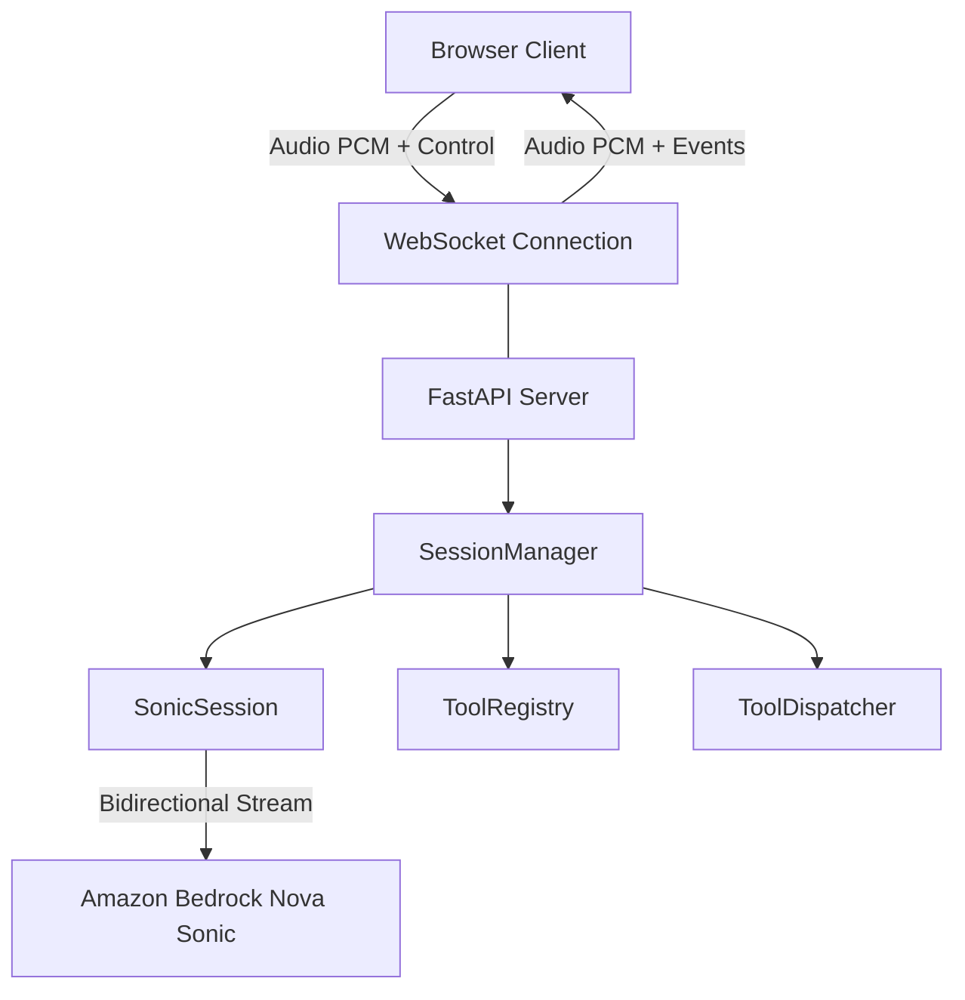
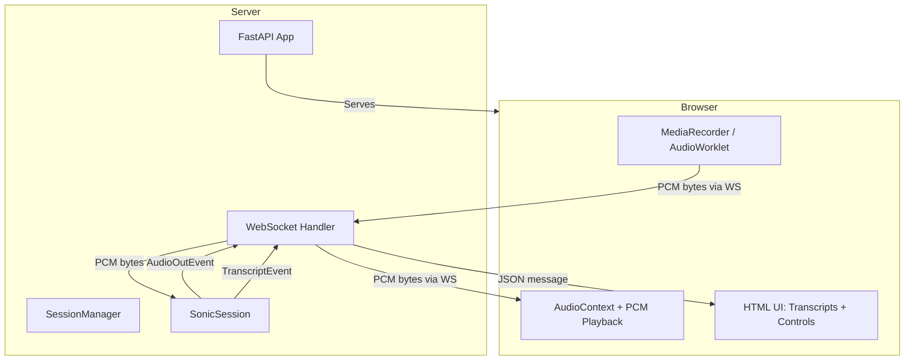
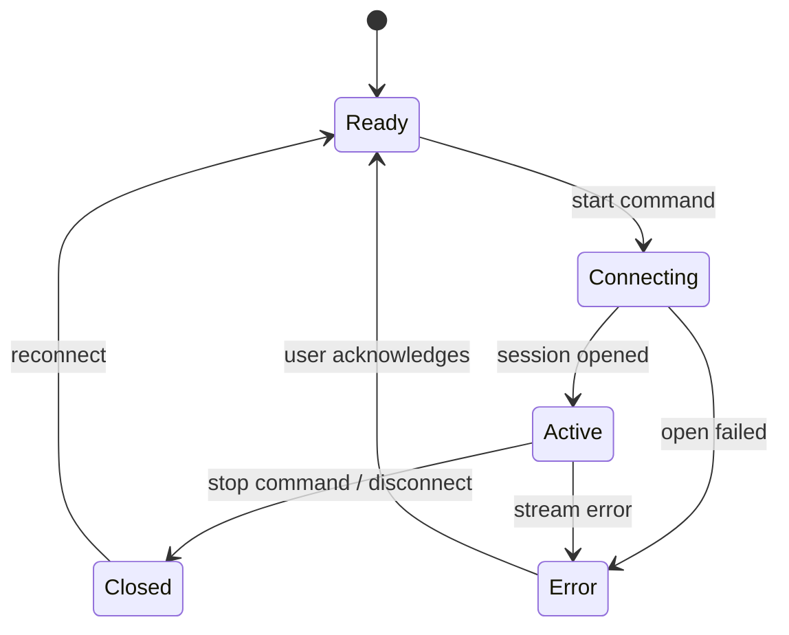

# Design Document: Web UI Speaking Session

## Overview

This feature adds a browser-based interface to the Nova Sonic chatbot demo, allowing users to start voice sessions from a web browser without requiring the CLI or local audio hardware drivers. The web UI communicates with a Python backend over WebSocket for real-time bidirectional audio streaming. The browser captures microphone audio (16 kHz / 16-bit / mono PCM), streams it to the server which feeds it into the existing `SonicSession`, and receives audio responses (24 kHz / 16-bit / mono PCM) back for playback. Transcripts and tool activity are displayed in real-time.

The architecture reuses the existing `SonicSession`, `ToolRegistry`, and `ToolDispatcher` unchanged. A new FastAPI-based web server acts as the bridge between the browser's WebSocket connection and the Bedrock bidirectional stream, replacing only the audio I/O layer (previously `AudioCapturer`/`AudioPlayer`) with WebSocket message routing.

## Architecture





## Components and Interfaces

### Component 1: FastAPI Web Server (`nova_sonic_demo/web/app.py`)

**Purpose**: Serves the static HTML/JS frontend and exposes the WebSocket endpoint for audio streaming.

**Interface**:
```python
from fastapi import FastAPI, WebSocket

app: FastAPI

# GET / — serves the HTML page
@app.get("/")
async def index() -> HTMLResponse: ...

# WebSocket /ws/session — bidirectional audio + control channel
@app.websocket("/ws/session")
async def websocket_session(ws: WebSocket) -> None: ...
```

**Responsibilities**:
- Serve the single-page HTML/JS frontend
- Accept WebSocket connections from browsers
- Validate that AWS credentials and region are available before opening a session
- Delegate session lifecycle to `SessionManager`
- Gracefully handle connection drops and errors

---

### Component 2: SessionManager (`nova_sonic_demo/web/session_manager.py`)

**Purpose**: Manages the lifecycle of a single `SonicSession` bound to one WebSocket connection. Bridges WebSocket messages to/from the session.

**Interface**:
```python
class SessionManager:
    def __init__(self, ws: WebSocket) -> None: ...

    async def start(self) -> None:
        """Resolve credentials, build session, open Bedrock stream."""
        ...

    async def handle_audio(self, pcm_bytes: bytes) -> None:
        """Forward browser audio to SonicSession.send_audio()."""
        ...

    async def run_event_loop(self) -> None:
        """Consume SonicSession.stream_events() and route to WebSocket."""
        ...

    async def stop(self) -> None:
        """Close session gracefully within shutdown deadline."""
        ...
```

**Responsibilities**:
- Build `ToolRegistry`, `ToolDispatcher`, and `SonicSession` per connection
- Forward incoming PCM audio from WebSocket to `SonicSession.send_audio()`
- Consume `stream_events()` and send `AudioOutEvent` PCM back over WebSocket
- Send `TranscriptEvent` and tool activity as JSON messages over WebSocket
- Handle `BedrockOpenError` and report user-friendly error messages
- Enforce shutdown deadline on disconnect

---

### Component 3: WebSocket Message Protocol

**Purpose**: Defines the binary and JSON message format exchanged between browser and server over the WebSocket.

**Interface**:

Messages from **Browser → Server**:
| Type | Format | Description |
|------|--------|-------------|
| Audio | Binary (bytes) | Raw 16 kHz/16-bit/mono PCM audio frames |
| Control | JSON `{"type": "start"}` | Request to open a new session |
| Control | JSON `{"type": "stop"}` | Request to close the session |

Messages from **Server → Browser**:
| Type | Format | Description |
|------|--------|-------------|
| Audio | Binary (bytes) | Raw 24 kHz/16-bit/mono PCM audio frames |
| Transcript | JSON `{"type": "transcript", "role": "USER"|"ASSISTANT", "text": "..."}` | Real-time transcript |
| Tool Activity | JSON `{"type": "tool_call", "name": "...", "arguments": {...}}` | Tool invocation |
| Tool Activity | JSON `{"type": "tool_result", "name": "...", "result": {...}}` | Tool result |
| Status | JSON `{"type": "status", "state": "ready"|"connecting"|"active"|"error"|"closed"}` | Session state |
| Error | JSON `{"type": "error", "message": "..."}` | Error description |

---

### Component 4: Browser Client (`nova_sonic_demo/web/static/index.html`)

**Purpose**: Single-page HTML/JS application that captures microphone audio, streams it over WebSocket, plays received audio, and displays transcripts.

**Interface**:
```python
# This is a static HTML file served by FastAPI.
# No Python interface — described here for completeness.
```

**Responsibilities**:
- Render a simple UI with Start/Stop button, transcript area, and status indicator
- Request microphone permission via `getUserMedia`
- Capture audio using `AudioWorklet` (or `ScriptProcessorNode` fallback) at 16 kHz/16-bit/mono
- Convert captured audio to PCM bytes and send as binary WebSocket messages
- Receive binary WebSocket messages and play as 24 kHz/16-bit/mono PCM via `AudioContext`
- Receive JSON WebSocket messages and update transcript display and tool activity log
- Handle errors gracefully with user-friendly messages
- Disable Start button while session is active; enable Stop button

---

### Component 5: WebLogger (`nova_sonic_demo/web/logger.py`)

**Purpose**: A `ConsoleLogger`-compatible logger that routes log events to the WebSocket instead of stdout.

**Interface**:
```python
from nova_sonic_demo.logging import ConsoleLogger

class WebLogger(ConsoleLogger):
    def __init__(self, send_fn: Callable[[dict], Awaitable[None]]) -> None: ...

    def tool_call(self, name: str, arguments: Any) -> None:
        """Send tool_call event over WebSocket instead of stdout."""
        ...

    def tool_result(self, name: str, result: Any) -> None:
        """Send tool_result event over WebSocket instead of stdout."""
        ...
```

**Responsibilities**:
- Override `tool_call` and `tool_result` to send JSON messages via WebSocket
- Maintain session-active gating (inherited from `ConsoleLogger`)
- Suppress stdout output (all output goes to WebSocket)

## Data Models

### WebSocket Message (Server → Browser)

```python
from typing import Literal, Union
from dataclasses import dataclass

@dataclass
class TranscriptMessage:
    type: Literal["transcript"] = "transcript"
    role: Literal["USER", "ASSISTANT"]
    text: str

@dataclass
class ToolCallMessage:
    type: Literal["tool_call"] = "tool_call"
    name: str
    arguments: dict

@dataclass
class ToolResultMessage:
    type: Literal["tool_result"] = "tool_result"
    name: str
    result: dict

@dataclass
class StatusMessage:
    type: Literal["status"] = "status"
    state: Literal["ready", "connecting", "active", "error", "closed"]

@dataclass
class ErrorMessage:
    type: Literal["error"] = "error"
    message: str

ServerMessage = Union[TranscriptMessage, ToolCallMessage, ToolResultMessage, StatusMessage, ErrorMessage]
```

**Validation Rules**:
- `role` must be either `"USER"` or `"ASSISTANT"`
- `state` must be one of the defined literals
- `text` and `message` must be non-empty strings
- `arguments` and `result` must be JSON-serializable dicts

### WebSocket Message (Browser → Server)

```python
@dataclass
class StartCommand:
    type: Literal["start"] = "start"

@dataclass
class StopCommand:
    type: Literal["stop"] = "stop"

ClientCommand = Union[StartCommand, StopCommand]
# Binary messages are raw PCM bytes (no wrapper)
```

**Validation Rules**:
- JSON messages must have a `type` field
- Binary messages must have length > 0 and be a multiple of 2 bytes (16-bit samples)

### Session State Machine



## Error Handling

### Error Scenario 1: Missing AWS Credentials

**Condition**: `assert_credentials_resolvable()` raises `MissingCredentialsError` during session start
**Response**: Send `{"type": "error", "message": "AWS credentials are not configured. Please set AWS_ACCESS_KEY_ID and AWS_SECRET_ACCESS_KEY or configure a default profile."}` and transition to Error state
**Recovery**: User fixes credentials and clicks Start again

### Error Scenario 2: Unsupported Region

**Condition**: `validate_region()` raises `UnsupportedRegionError`
**Response**: Send `{"type": "error", "message": "AWS region '<region>' does not support Nova Sonic. Supported: us-east-1, us-east-2, us-west-2, ap-northeast-1."}` and transition to Error state
**Recovery**: User sets a supported region and clicks Start again

### Error Scenario 3: Bedrock Stream Open Failure

**Condition**: `session.open()` raises `BedrockOpenError`
**Response**: Send `{"type": "error", "message": "Failed to connect to Bedrock: <category> - <details>"}` and transition to Error state
**Recovery**: User resolves the underlying issue and clicks Start again

### Error Scenario 4: WebSocket Disconnection

**Condition**: Browser closes the WebSocket (tab close, network drop, navigation)
**Response**: Server detects disconnect, calls `session.close()` within `SHUTDOWN_DEADLINE_S`, cleans up resources
**Recovery**: User reconnects by refreshing the page

### Error Scenario 5: Microphone Permission Denied

**Condition**: Browser denies `getUserMedia` request
**Response**: Display client-side error: "Microphone access is required. Please allow microphone permission and try again."
**Recovery**: User grants permission in browser settings and clicks Start again

### Error Scenario 6: Browser Audio API Unavailable

**Condition**: Browser does not support `AudioContext` or `getUserMedia`
**Response**: Display client-side error: "Your browser does not support the required audio APIs. Please use a modern browser (Chrome, Firefox, Edge)."
**Recovery**: User switches to a supported browser

## Testing Strategy

### Unit Testing Approach

- **SessionManager**: Test with a mock WebSocket and mock `SonicSession` to verify message routing, error handling, and lifecycle management
- **WebLogger**: Test that tool_call/tool_result events are serialized correctly and sent via the callback
- **WebSocket Protocol**: Test message serialization/deserialization for all message types
- **Error paths**: Test each error scenario produces the correct error message format

**Property-Based Testing Approach**:

**Property Test Library**: hypothesis

- Binary audio messages: any valid PCM byte sequence (length > 0, multiple of 2) should be forwarded to `send_audio` unchanged
- JSON message serialization: for any valid `ServerMessage`, serializing then deserializing should produce an equivalent message
- Session state transitions: for any sequence of valid commands, the state machine should never reach an invalid state

### Integration Testing Approach

- Use `httpx` + `websockets` to test the full WebSocket flow against the FastAPI app with a mocked `SonicSession`
- Verify the static file serving returns valid HTML
- Verify WebSocket upgrade succeeds and the protocol handshake works

## Performance Considerations

- **Audio latency**: The WebSocket path adds minimal latency compared to the CLI's direct PortAudio path. Target < 50ms additional round-trip latency from WebSocket framing.
- **Buffer management**: The browser should send audio in chunks matching the VAD batch size (~80ms) to avoid excessive WebSocket message overhead.
- **Concurrent sessions**: Each WebSocket connection holds one `SonicSession` (one Bedrock stream). The server should support multiple concurrent connections but each is independent.
- **Memory**: PCM audio buffers are transient. No long-term accumulation since audio is streamed through, not stored.

## Security Considerations

- **CORS**: The FastAPI server serves both the static frontend and the WebSocket endpoint from the same origin, avoiding CORS issues.
- **Authentication**: This is a local demo tool. No authentication is added. The server binds to `127.0.0.1` by default to prevent external access.
- **Input validation**: Binary WebSocket messages are validated (non-empty, even byte count) before forwarding to `send_audio`. JSON messages are validated against the expected schema.
- **Resource limits**: A maximum of one active session per WebSocket connection. Connections that send invalid messages are closed.

## Correctness Properties

*A property is a characteristic or behavior that should hold true across all valid executions of a system — essentially, a formal statement about what the system should do. Properties serve as the bridge between human-readable specifications and machine-verifiable correctness guarantees.*

### Property 1: Audio forwarding with validation

*For any* binary message received over WebSocket and *for any* session state, the message is forwarded to `SonicSession.send_audio()` unchanged if and only if the session state is `active` AND the byte length is greater than zero AND the byte length is a multiple of 2. In all other cases, the message is discarded.

**Validates: Requirements 2.5, 3.3, 3.5, 6.6, 7.4**

### Property 2: AudioOut event routing preserves bytes

*For any* `AudioOutEvent` emitted by `SonicSession.stream_events()`, the Session_Manager sends the exact PCM bytes as a binary WebSocket message to the browser without modification.

**Validates: Requirements 2.6, 3.4**

### Property 3: Transcript event serialization

*For any* `TranscriptEvent` with role in `{"USER", "ASSISTANT"}` and any non-empty text string, the Session_Manager produces a JSON message `{"type": "transcript", "role": <role>, "text": <text>}` that, when deserialized, yields the original role and text values.

**Validates: Requirements 4.1**

### Property 4: WebLogger serialization correctness

*For any* tool name (non-empty string) and *for any* JSON-serializable arguments/result dict, invoking `WebLogger.tool_call(name, arguments)` or `WebLogger.tool_result(name, result)` while the session is active produces a JSON message containing the original name and payload. When the session is not active, no message is produced. When the payload is not JSON-serializable, the literal `"<non-serializable>"` is substituted.

**Validates: Requirements 4.2, 4.3, 8.2, 8.3, 8.4, 8.5**

### Property 5: Session state machine validity

*For any* sequence of commands (`start`, `stop`) and events (open success, open failure, stream error, disconnect), the Session_Manager state transitions follow the defined state machine: `ready → connecting → active → closed`, with error transitions only from `connecting` or `active`. No invalid state is ever reached, and status messages accurately reflect the current state.

**Validates: Requirements 6.1, 6.2, 6.3, 6.4, 6.5**

### Property 6: Command message validation

*For any* JSON text received over WebSocket, only messages that parse as valid JSON AND contain a `type` field with value `"start"` or `"stop"` are processed as commands. All other JSON text messages (malformed JSON, missing type field, unrecognized type values) are silently ignored without error.

**Validates: Requirements 7.1, 7.2, 7.3**

## Dependencies

- **fastapi** — Lightweight async web framework with WebSocket support
- **uvicorn** — ASGI server to run the FastAPI app
- **websockets** — WebSocket protocol implementation (used by uvicorn internally)
- Existing: `boto3`, `aws-sdk-bedrock-runtime` (reused via `SonicSession`)
